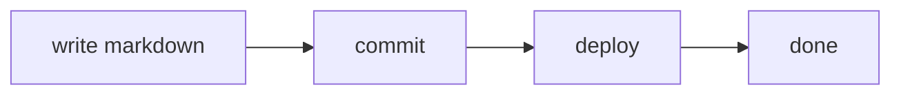

<!-- Delete this file once you have written your own. Authoring notes in
     leading HTML comments like this one never render. -->

This is an example post. Drop a `.md` file into `content/blog/` and it shows
up in the Writing list; delete it and it is gone. The filename becomes the
URL slug, so this post lives at `#/blog/hello-world`.

## Frontmatter

Every post starts with a small header block:

```
---
title: Human-readable title
date: YYYY-MM-DD
topics: comma, separated
summary: one line shown in the post list
draft: true            (optional — keeps the post off the site)
---
```

Set `draft: true` while you are still writing. Posts sort by `date`,
newest first, and the list paginates automatically.

## What the renderer supports

Standard markdown — **bold**, *italic*, `inline code`, [links](https://example.com),
lists, blockquotes, and tables:

| Feature | Supported |
| ------- | --------- |
| Tables | yes |
| Fenced code | yes |
| Mermaid diagrams | yes |

> Blockquotes render as a muted panel with a left border.

Fenced code blocks keep their language label:

```js
export const POSTS = files.map(parse).filter((p) => !p.draft)
```

## Diagrams

A ` ```mermaid ` fence renders as a live diagram, themed to match the site
and re-rendered when the reader flips between light and dark:



## Images

Put images in `public/blog/<slug>/` and reference them by absolute path:

```

```

That keeps each post's assets next to each other and survives a rename of
the post title.
